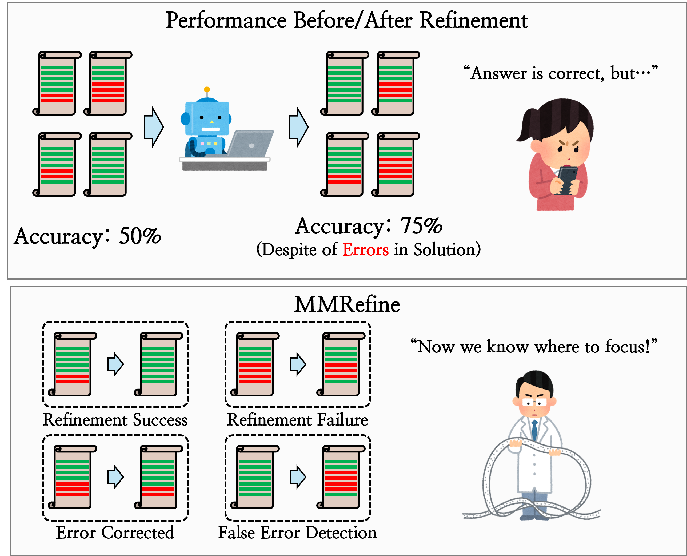

# MMRefine 💭: Multimodal Refinement Benchmark
> [MMRefine: Unveiling the Obstacles to Robust Refinement in Multimodal Large Language Models](https://arxiv.org/abs/2506.04688)    
> [Gio Paik](http://sites.google.com/view/giopaik), [Geewook Kim](https://geewook.kim/) and [Jinbae Im](https://scholar.google.com/citations?user=RbmA27QAAAAJ)*. *ACL Findings 2025*

[**🌐 Webpage**](https://mmrefine.github.io/) | [**🤗 Dataset**](https://huggingface.co/datasets/naver-ai/mmrefine) | [**📖 Paper**](https://arxiv.org/abs/2506.04688) | [**🏆 Leaderboard**](https://mmrefine.github.io/#leaderboard)

## News
**[2025.08.13]** 🚀 MMRefine has been implemented in [lmms-eval](https://github.com/EvolvingLMMs-Lab/lmms-eval), an evaluation tool for Multimodal Language Models!
**[2025.07.14]** 🚀 Our [dataset](https://huggingface.co/datasets/naver-ai/mmrefine) and [evaluation code](https://github.com/naver-ai/MMRefine) are available!    
**[2025.06.06]** 📜 We released our paper on [ArXiv](https://arxiv.org/abs/2506.04688)!    
**[2025.06.06]** 🏆 [Leaderboard](https://mmrefine.github.io/#leaderboard) is online!    
**[2025.05.14]** 🥳 MMRefine is accepted by ACL Findings 2025!

## Introduction

<p align="center">
  
</p>

MMRefine provides a comprehensive analysis of MLLMs' capability to detect and correct errors within a given initial solution across six distinct scenarios and six error types, which is an ability essential for test-time scaling techniques such as self-reflection or multi-agent debate.

## (Recommended) Evaulation using `lmms-eval`
We strongly recommend using [lmms-eval](https://github.com/EvolvingLMMs-Lab/lmms-eval), an open-source, easy-to-use evaluation tool for MLLMs that supports various MLLM families (e.g., GPT, Gemini, LLaMA).

First, install `lmms-eval`.
```sh
git clone https://github.com/EvolvingLMMs-Lab/lmms-eval
cd lmms-eval
uv venv dev
source dev/bin/activate
uv pip install -e .
```

Then, evaulate your model using the following code. (Please refer to [lmms-eval's docs](https://github.com/EvolvingLMMs-Lab/lmms-eval/blob/main/docs/README.md) to change the model.)
```sh
python3 -m lmms_eval \
    --model openai_compatible \
    --model_args model_version=gpt-4.1,azure_openai=False \
    --tasks mmrefine \
    --batch_size 1 
```

You need to set your OpenAI API Key as an environment variable for evaluation. You can set it using:
```sh
export OPENAI_API_KEY="<YOUR_API_KEY>"
```

## Evaulation using Codes in Official Repo
### Requirements
To install the required packages:
```sh
pip install -r requirements.txt
```

You need to set your OpenAI API Key as an environment variable for evaluation. You can set it using:
```sh
export OPENAI_API_KEY="<YOUR_API_KEY>"
```

### Evaluation
1. First, you need to make a submission file for evaluation with a MLLM that you want to evaluate.
    - Implement your inference code in [inference code](inference/main.py#L16).
    - Run inference to generate a `submission.json` file. Please refer to [sample_submission_file.json](inference/sample_submission_file.json).
2. Run `evaluation/main.py` with submission file you've made.
```sh
python evaluation/main.py --submission_file <path-to-your-submission-file>
```

## Cite
```
@inproceedings{paik-etal-2025-mmrefine,
    title = "{MMR}efine: Unveiling the Obstacles to Robust Refinement in Multimodal Large Language Models",
    author = "Paik, Gio  and
      Kim, Geewook  and
      Im, Jinbae",
    editor = "Che, Wanxiang  and
      Nabende, Joyce  and
      Shutova, Ekaterina  and
      Pilehvar, Mohammad Taher",
    booktitle = "Findings of the Association for Computational Linguistics: ACL 2025",
    month = jul,
    year = "2025",
    address = "Vienna, Austria",
    publisher = "Association for Computational Linguistics",
    url = "https://aclanthology.org/2025.findings-acl.1378/",
    pages = "26883--26904",
    ISBN = "979-8-89176-256-5",
    abstract = "This paper introduces MMRefine, a MultiModal Refinement benchmark designed to evaluate the error refinement capabilities of Multimodal Large Language Models (MLLMs). As the emphasis shifts toward enhancing reasoning during inference, MMRefine provides a framework that evaluates MLLMs' abilities to detect and correct errors across six distinct scenarios beyond just comparing final accuracy before and after refinement. Furthermore, the benchmark analyzes the refinement performance by categorizing errors into six error types.Experiments with various open and closed MLLMs reveal bottlenecks and factors impeding refinement performance, highlighting areas for improvement in effective reasoning enhancement. Our code and dataset are publicly available at \url{https://github.com/naver-ai/MMRefine}."
}
```

## License
```
MMRefine
Copyright (c) 2025-present NAVER Cloud Corp.
Licensed under the Apache License, Version 2.0 (the "License");
you may not use this file except in compliance with the License.
You may obtain a copy of the License at
    http://www.apache.org/licenses/LICENSE-2.0
Unless required by applicable law or agreed to in writing, software
distributed under the License is distributed on an "AS IS" BASIS,
WITHOUT WARRANTIES OR CONDITIONS OF ANY KIND, either express or implied.
See the License for the specific language governing permissions and
limitations under the License.
```
